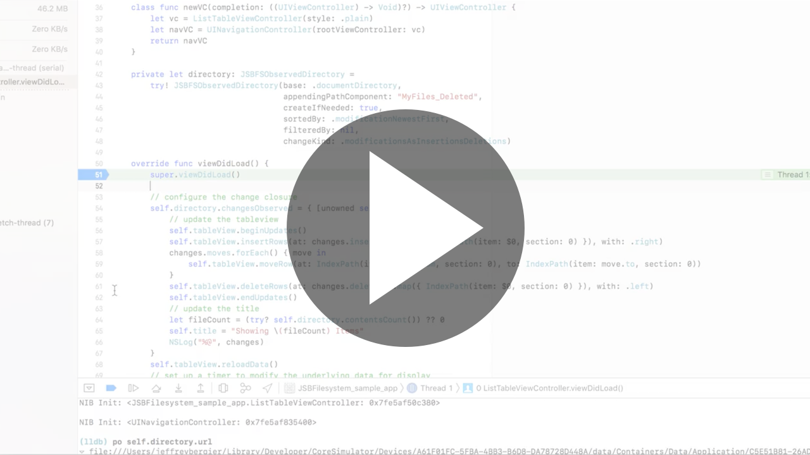

    

# JSBFilesystem

## Description
A small library that makes it easy to display data that exists as files on the disk of the local device. The library also makes it easy monitor additions, deletions, and modifications to the files so you can keep  TableViews, CollectionViews, or any user interface up-to-date. This library uses `NSFilePresenter` for notifications from the operating system when files change and then uses [IGListKit](https://github.com/Instagram/IGListKit) to diff the old and new contents.

The library also features an extensive set of helper methods on `NSFileCoordinator`. These helper methods work with typical Swift error handling, unlike `NSFileCoordinator`, and greatly reduce the boilerplate needed to safely read and write files while multiple processes may be accessing them at once.

The library is 100% written in Objective-C. This was a conscious choice to reduce bridging overhead. When reading, sorting, and filtering Arrays of URL's the overhead of switching back and forth between NSArray<NSURL> to Array<URL> can be quite high. Despite being written in Objective-C, there are ample annotations so that everything feels very natural in Swift.
  
## Sample App & Demonstration Video
Included with the project is a small sample app. This app shows how easy it is to read, write, delete, and modify files while displaying them in a UITableView while animating changes appropriately. Take a look at how small the [code file](/JSBFilesystem/JSBFilesystem_sample_app/ListTableViewController.swift) is for this sample app.
[](README/demo-video.mp4)

## Important Classes

### [`JSBFSDirectory`](/JSBFilesystem/JSBFilesystem_Shared/JSBFSDirectory.h#L41)
Provides the basic API needed to access a directory in a way that is compatible with TableViews. This class provides customized [sorting](/JSBFilesystem/JSBFilesystem_Shared/JSBFSDirectory.h#L60) and [filtering](/JSBFilesystem/JSBFilesystem_Shared/JSBFSDirectory.h#L55) of the files in the directory.
- Important methods for TableViews
    - `-(NSInteger)contentsCount:`
        - Use in `numberOfRowsInSection:`
    - `(NSURL*)urlAtIndex:error:`
        - Use in `cellForRowAtIndexPath:`
        - Use [`[+NSFileCoordinator JSBFS_readDataFromURL:error:]`](/JSBFilesystem/JSBFilesystem_Shared/NSFileCoordinator%2BJSBFS.h#L77) to fetch the data at that URL that can be deserialized into an instance of your model object.
 Note: This class has to fetch, sort, and filter every URL in the directory every time you call any method on it. This makes it not ideal for frequent access. It also does not provide any ability to provide updates when the files on disk change. To solve both of those problems, see `JSBFSObservedDirectory`.
 
### [`JSBFSObservedDirectory`](/JSBFilesystem/JSBFilesystem_Shared/JSBFSObservedDirectory.h#L49)
A subclass of `JSBFSDirectory` that adds the ability to subscribe to changes from the filesystem. Once subscribed, the sorted and filtered directory contents are cached internally so they can be accessed quickly. When an update occurs on the disk, the new contents are diffed against the currently cached contents. If there are differences, the `changesOcurred` block is executed with the changes so you can update your UI.
- Important properties for TableViews
    - [`changesObserved`](/JSBFilesystem/JSBFilesystem_Shared/JSBFSObservedDirectory.h#L70)
        - A block that is executed whenever there are changes with the subfiles of the observed directory. Take a look at the [sample app code](/JSBFilesystem/JSBFilesystem_sample_app/ListTableViewController.swift#L54-L67) to see how to do batch updates with `UITableView` with this property.
        - **Note:** When this property is `nil`, the object behaves exactly like its superclass. Once its set, its behavior changes because it builds an internal cache that greatly speeds up `-(NSInteger)contentsCount:`, `(NSURL*)urlAtIndex:error:`, and other methods.
        - **Note:** Once this property is set, the ObservedDirectory object is added to NSFilePresenter for updates. NSFilePresenter holds a strong reference to presenting objects. You must set this property to `nil` manually or else it will leak.
        - **Note:** This object holds a strong reference to this block. Be careful about creating retain cycles when referencing self inside of the block.
    - [`changeKind`](/JSBFilesystem/JSBFilesystem_Shared/JSBFSObservedDirectory.h#L85)
        - An ENUM ([`JSBFSObservedDirectoryChangeKind`](/JSBFilesystem/JSBFilesystem_Shared/SmallTypes.h#L79)) that tells this object how to diff the directory contents when updates occur. Some collection view types support reloading rows during batch updates and others do not. For example `NSOutlineView` supports reloading rows during batch updates but `UICollectionView` does not. 
        - Depending on the value of this enum, the `changesObserved` block will be executed with a [`JSBFSDirectoryChanges`](/JSBFilesystem/JSBFilesystem_Shared/JSBFSDirectoryChanges.h#L41) or a [`JSBFSDirectoryChangesFull`](/JSBFilesystem/JSBFilesystem_Shared/JSBFSDirectoryChanges.h#L62) object. The former has file modifications represented as insertions and deletions and supports `UICollectionView` and similar views. The latter includes modifications normally and works with `NSOutlineView` and similar views.

### [`NSFileCoordinator+JSBFS.h`](/JSBFilesystem/JSBFilesystem_Shared/NSFileCoordinator%2BJSBFS.h#L34)
This file includes a bunch of helper methods on NSFileCoordinator that make using NSFileCoodinator far easier. They also support standard Swift error handling with try, catch unlike NSFileCoordinator.
- Important Methods
    - `+(BOOL)JSBFS_writeData:toURL:filePresenter:error:`
    - `+(BOOL)JSBFS_writeFileWrapper:toURL:filePresenter:error:`
    - `+(NSData*)JSBFS_readDataFromURL:filePresenter:error:`
    - `+(NSData*)JSBFS_readFileWrapperFromURL:filePresenter:error:`
    - `+(BOOL)JSBFS_readAndWriteDataAtURL:afterTransformdingWithBlock:filePresenter:error:`
    - `+(BOOL)JSBFS_readAndWriteFileWrapperAtURL:afterTransformdingWithBlock:filePresenter:error:`
    
### `NSFileWrapper`
Is a fantastic API from Apple that allows easily reading and writing [Document "Packages."](https://developer.apple.com/library/archive/documentation/CoreFoundation/Conceptual/CFBundles/DocumentPackages/DocumentPackages.html#//apple_ref/doc/uid/10000123i-CH106-SW1) NSFileWrapper is fully supported by `NSFileCoordinator+JSBFS`. There are matching `NSFileWrapper` methods for every `NSData` based method. This allows reading and writing of very complex files that can't be serialized as a single `NSData` blob. 

The API can be a little bit fiddly, but take a look at the following example. This will make a new document package that has a child `PLIST` data payload and a child `PNG` image payload. The final line of code write the document package to disk. If you inspected the filesystem after writing this code you would see a folder with `payload.plist` and `image.png` as files in that folder.

```swift
do {
    let payloadData = try self.model.plistData()
    let payloadWrapper = FileWrapper(regularFileWithContents: payloadData)
    payloadWrapper.preferredFilename = "payload.plist"
    let imageData = try self.model.image.pngData()
    let imageWrapper = FileWrapper(regularFileWithContents: imageData)
    imageWrapper.preferredFilename = "image.png"
    let parentWrapper = FileWrapper(directoryWithFileWrappers: [
        "payload.plist": payloadWrapper,
        "image.png": imageWrapper
        ])
    let fileURL = self.directory.appendingPathComponent(self.fileName)
    try NSFileCoordinator.JSBFS_write(parentWrapper, to: fileURL, filePresenter: nil)
} catch {
    let e = String(describing: error)
    NSLog(e)
}
```

        
## Code of Conduct

JSBFilesystem has a [Code of Conduct](/CODE_OF_CONDUCT.md) for its community on Github. I want all people that participate in issues, comments, pull requests, or any other part of the project to feel safe from harassment. Every person must treat every other person with respect and dignity or else face banning from the community. If you feel someone has not treated you with respect, [please let me know in private](mailto:jsbfilesystemcommunity@jeffburg.com).
    
## Guidelines for Contributing

I am happy to have others contribute to JSBFilesystem. This is my first general purpose library I have ever published and I'm sure it could use many many improvements.

### Do's

1. **Do** go through open issues and look for an issue you are interested in tackling.
1. **Do** create a new issue if one doesn't exist.
1. **Do** mention that you intend to work on the issue.
1. **Do** implement the intended feature **AND** basic tests for the new functionality.
1. **Do** feel comfortable asking for help or guidance in the issue, I love to help.
1. **Do** feel free to improve documentation and fix typos, **ALL** contributions are valuable.

### Don'ts

1. **Don't** submit a pull request that has no related issue.
1. **Don't** break any App Store rules in your changes.
1. **Don't** add a new Cocoapod or other third party code/assets unless its been discussed.

## Check Existing Issues

- [Existing Issues for JSBFilesystem](https://github.com/jeffreybergier/JSBFilesystem/issues)

## Installation

### Cocoapods

`pod 'JSBFilesystem'`
